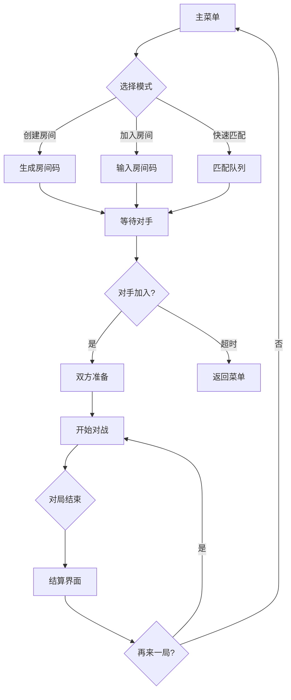
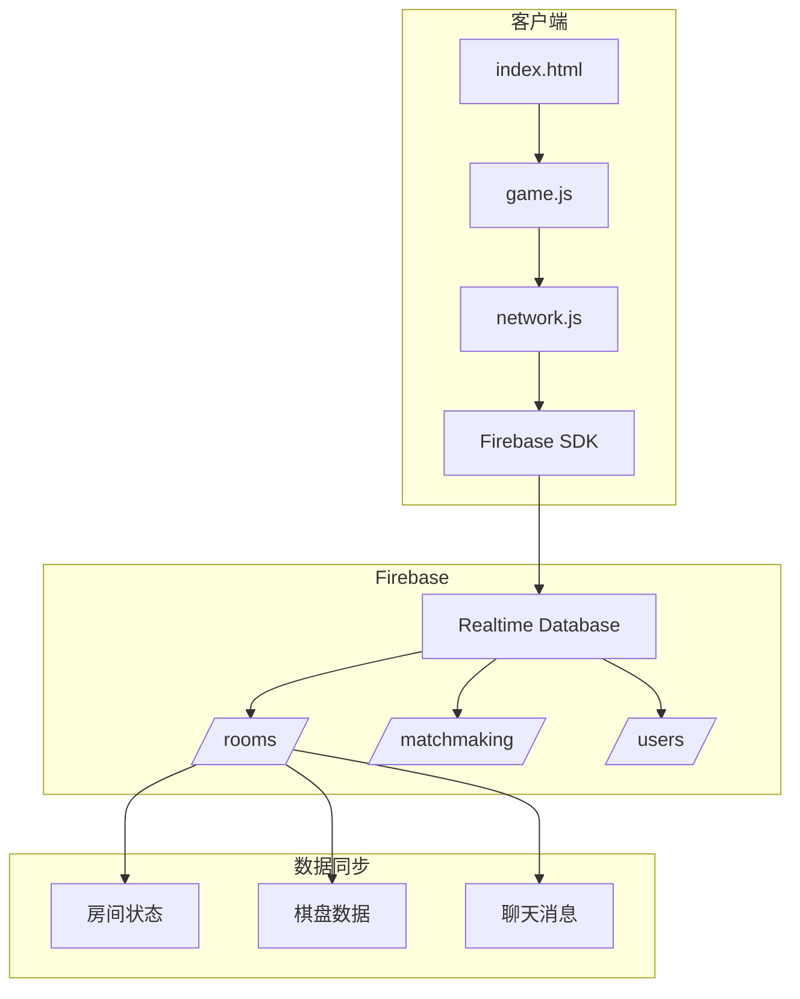
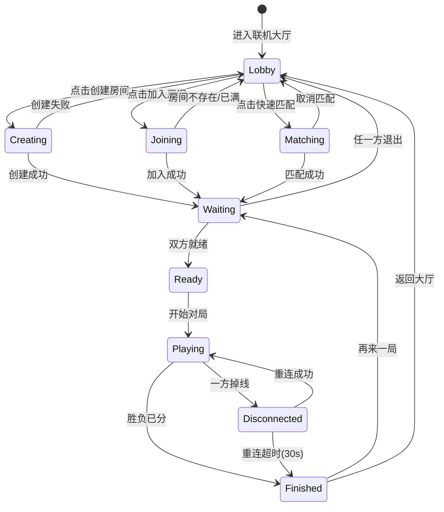
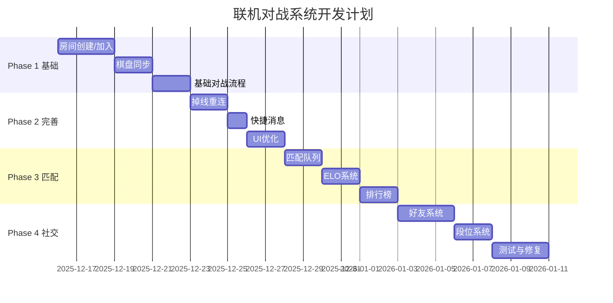

# 🎮 五子棋联机对战系统设计文档

> 版本：v1.1  
> 日期：2025-12-14  
> 状态：设计阶段（已完善）

---

## 目录

1. [产品经理视角](#一产品经理视角)
2. [游戏美术视角](#二游戏美术视角)
3. [数值策划视角](#三数值策划视角)
4. [前后端开发视角](#四前后端开发视角)
5. [服务器架构视角](#五服务器架构视角)
6. [实施计划](#六实施计划)

---

## 一、产品经理视角

### 1.1 核心价值主张

| 维度 | 当前状态 | 联机后 |
|------|----------|--------|
| 用户留存 | 单机易流失 | 社交粘性高 |
| 日活时长 | ~10分钟 | ~30分钟+ |
| 传播系数 | 1.0 | 2.0+ (邀请好友) |
| 商业化潜力 | 低 | 高 (皮肤/特效) |

### 1.2 功能需求清单

#### P0 - 核心功能（第一期必须）

- [ ] **房间系统**
  - 创建房间（生成6位房间码）
  - 加入房间（输入房间码）
  - 房间状态显示（等待中/游戏中/已结束）
  
- [ ] **实时对战**
  - 棋盘状态同步
  - 回合切换通知
  - 落子动画同步
  - 胜负判定同步

- [ ] **基础交互**
  - 准备/取消准备
  - 认输按钮
  - 请求和棋

#### P1 - 重要功能（第二期）

- [ ] **快速匹配**
  - 匹配队列
  - 匹配超时处理
  - 取消匹配

- [ ] **掉线处理**
  - 断线重连（30秒内）
  - 超时判负
  - 网络状态提示

- [ ] **快捷消息**
  - 预设表情（8-12个）
  - 预设短语（"你好"/"再来一局"等）

#### P2 - 增值功能（第三期）

- [ ] **好友系统**
  - 添加好友
  - 好友列表
  - 在线状态
  - 邀请对战

- [ ] **排位系统**
  - 段位显示
  - 积分变化
  - 赛季重置

- [ ] **排行榜**
  - 日榜/周榜/总榜
  - 好友榜

### 1.3 用户流程图



### 1.4 风险评估

| 风险 | 影响 | 可能性 | 缓解措施 |
|------|------|--------|----------|
| 网络延迟高 | 高 | 中 | 乐观更新 + 状态回滚 |
| 作弊外挂 | 高 | 低 | 服务端校验所有落子 |
| 匹配等待久 | 中 | 中 | 显示在线人数 + AI填充 |
| 恶意刷分 | 中 | 低 | 异常检测 + 封号机制 |

### 1.5 用户故事

| ID | 作为... | 我想要... | 以便于... |
|----|---------|-----------|------------|
| US-01 | 玩家 | 快速创建房间并获取房间码 | 邀请朋友一起玩 |
| US-02 | 玩家 | 输入房间码加入好友的房间 | 与特定朋友对战 |
| US-03 | 玩家 | 看到对手的在线状态 | 知道对方是否还在 |
| US-04 | 玩家 | 对局中途掉线后能重连 | 不丢失对局进度 |
| US-05 | 玩家 | 使用快捷表情交流 | 增加互动乐趣 |
| US-06 | 玩家 | 查看自己的对战记录 | 追踪进步 |
| US-07 | 新玩家 | 快速匹配到水平相近的对手 | 获得公平对局体验 |

### 1.6 关键成功指标 (KPIs)

| 指标 | 基准值 | 目标值 | 测量方式 |
|------|--------|--------|----------|
| 联机对局完成率 | - | ≥85% | 开始对局数/完成对局数 |
| 匹配等待时间 | - | ≤60秒 | 平均匹配时长 |
| 掉线重连成功率 | - | ≥90% | 重连次数/掉线次数 |
| 日活跃联机用户 | 0 | 100+ | Firebase Analytics |
| 每用户联机场次 | - | ≥3局/日 | 数据埋点 |

### 1.7 边缘场景处理

| 场景 | 处理策略 |
|------|----------|
| 房主掉线 | 等待30秒，若未重连则转移房主权限给另一玩家 |
| 双方同时掉线 | 房间保留5分钟，任一方重连可继续 |
| 对局中一方关闭页面 | 视为掉线，启动30秒重连倒计时 |
| 房间码冲突 | 生成时查重，确保唯一性 |
| 恶意快速退出 | 记录逃跑次数，多次逃跑降低匹配优先级 |

---

## 二、游戏美术视角

### 2.1 新增UI界面清单

#### 联机大厅界面

```
┌─────────────────────────────────────┐
│  🎮 联机对战                    ✕   │
├─────────────────────────────────────┤
│                                     │
│   ┌───────────────────────────┐    │
│   │  🎯 快速匹配               │    │
│   │  预计等待: ~30秒           │    │
│   └───────────────────────────┘    │
│                                     │
│   ┌───────────────────────────┐    │
│   │  🏠 创建房间               │    │
│   │  邀请好友一起玩            │    │
│   └───────────────────────────┘    │
│                                     │
│   ┌───────────────────────────┐    │
│   │  🚪 加入房间               │    │
│   │  输入房间码加入            │    │
│   └───────────────────────────┘    │
│                                     │
│   📊 当前在线: 128人               │
└─────────────────────────────────────┘
```

#### 房间等待界面

```
┌─────────────────────────────────────┐
│  房间号: ABC123               复制  │
├─────────────────────────────────────┤
│                                     │
│  ┌─────────┐    VS    ┌─────────┐  │
│  │  👤     │          │  ❓     │  │
│  │ 玩家名  │          │ 等待中… │  │
│  │ ✅已准备 │          │         │  │
│  └─────────┘          └─────────┘  │
│                                     │
│  ───────────────────────────────   │
│                                     │
│   [ 取消准备 ]    [ 退出房间 ]      │
│                                     │
└─────────────────────────────────────┘
```

#### 对战中HUD

```
┌─────────────────────────────────────┐
│ 👤玩家A (黑)        ⏱️ 00:45        │
│ ████████░░ 1200分   🔵 你的回合     │
├─────────────────────────────────────┤
│                                     │
│           [ 棋盘区域 ]              │
│                                     │
├─────────────────────────────────────┤
│ 👤玩家B (白)        ⏱️ 01:23        │
│ ██████░░░░ 980分    ⚪ 对手回合     │
├─────────────────────────────────────┤
│ 💬快捷消息  🏳️认输  🤝请求和棋     │
└─────────────────────────────────────┘
```

### 2.2 美术资源清单

| 分类 | 资源 | 规格 | 状态 |
|------|------|------|------|
| 图标 | 联机入口图标 | 64x64 SVG | 待制作 |
| 图标 | 房间状态图标 | 32x32 SVG | 待制作 |
| 图标 | 段位徽章 x5 | 48x48 PNG | 待制作 |
| 动效 | 匹配中动画 | Lottie | 待制作 |
| 动效 | 连接状态指示器 | CSS | 可复用 |
| 音效 | 匹配成功 | MP3 | 待制作 |
| 音效 | 对手落子 | MP3 | 可复用 |
| 音效 | 胜利/失败 | MP3 | 可复用 |

### 2.3 设计规范

- **主色调**：延续赛博朋克风格
  - 主色：#a855f7 (紫色)
  - 强调：#00d4ff (青色)
  - 警告：#ff6b6b (红色)
  - 成功：#00ff88 (绿色)

- **在线状态指示**
  ```css
  .online-indicator {
      width: 10px;
      height: 10px;
      background: #00ff88;
      border-radius: 50%;
      animation: pulse 2s infinite;
  }
  ```

### 2.4 交互动效规范

```css
/* 匹配中脉冲动画 */
@keyframes matchingPulse {
    0%, 100% { transform: scale(1); opacity: 1; }
    50% { transform: scale(1.05); opacity: 0.8; }
}

.matching-indicator {
    animation: matchingPulse 1.5s ease-in-out infinite;
}

/* 对手加入闪光效果 */
@keyframes opponentJoin {
    0% { box-shadow: 0 0 0 0 rgba(0, 212, 255, 0.7); }
    70% { box-shadow: 0 0 0 15px rgba(0, 212, 255, 0); }
    100% { box-shadow: 0 0 0 0 rgba(0, 212, 255, 0); }
}

/* 回合切换提示 */
@keyframes turnPulse {
    0%, 100% { border-color: var(--accent-color); }
    50% { border-color: var(--primary-color); }
}
```

### 2.5 状态指示器设计

| 状态 | 颜色 | 图标 | 动画 |
|------|------|------|------|
| 在线 | #00ff88 | ● | 静态 |
| 连接中 | #ffcc00 | ◐ | 旋转 |
| 掉线 | #ff6b6b | ● | 闪烁 |
| 重连中 | #00d4ff | ↻ | 旋转 |

**快捷消息气泡**：
- 出现动画：从底部弹出 + 缩放
- 持续时间：3秒
- 消失动画：淡出
- 最大同屏数：3条

### 2.6 音效资源清单（完整版）

| 场景 | 文件名 | 时长 | 备注 |
|------|--------|------|------|
| 进入联机大厅 | lobby_enter.mp3 | 0.5s | 科技感开门声 |
| 创建房间成功 | room_create.mp3 | 0.8s | 清脆确认音 |
| 对手加入 | opponent_join.mp3 | 1.0s | 欢迎提示音 |
| 双方准备完成 | ready_complete.mp3 | 0.5s | 双重确认音 |
| 对局开始 | game_start.mp3 | 1.5s | 紧张开局音 |
| 轮到你 | your_turn.mp3 | 0.3s | 轻微提示 |
| 对手落子 | opponent_move.mp3 | 0.2s | 与己方落子音区分 |
| 收到消息 | chat_receive.mp3 | 0.3s | 气泡弹出音 |
| 对手掉线 | disconnect_warn.mp3 | 1.0s | 警告音 |
| 对手重连 | reconnect.mp3 | 0.5s | 恢复音 |
| 胜利 | victory_online.mp3 | 2.0s | 比单机版更激昂 |
| 失败 | defeat_online.mp3 | 2.0s | 比单机版更柔和 |

---

## 三、数值策划视角

### 3.1 ELO积分系统

#### 基础公式

```
新积分 = 旧积分 + K × (实际结果 - 预期结果)

预期结果 = 1 / (1 + 10^((对手积分 - 自己积分) / 400))

K值：
- 新手期（<30局）: K = 40
- 成长期（30-100局）: K = 32  
- 稳定期（>100局）: K = 24
```

#### 示例计算

| 场景 | 自己分数 | 对手分数 | 结果 | 积分变化 |
|------|----------|----------|------|----------|
| 击败同级 | 1000 | 1000 | 胜 | +20 |
| 击败高手 | 1000 | 1200 | 胜 | +28 |
| 击败新手 | 1000 | 800 | 胜 | +12 |
| 输给同级 | 1000 | 1000 | 负 | -20 |
| 输给高手 | 1000 | 1200 | 负 | -12 |
| 平局 | 1000 | 1000 | 平 | 0 |

### 3.2 段位系统

| 段位 | 积分范围 | 图标 | 晋升保护 | 赛季奖励 |
|------|----------|------|----------|----------|
| 青铜V-I | 0-999 | 🥉 | 无 | 50金币 |
| 白银V-I | 1000-1499 | 🥈 | 降级保护3局 | 100金币 |
| 黄金V-I | 1500-1999 | 🥇 | 降级保护3局 | 200金币 |
| 铂金V-I | 2000-2499 | 💠 | 降级保护5局 | 300金币 |
| 钻石V-I | 2500-2999 | 💎 | 降级保护5局 | 500金币 |
| 大师 | 3000-3499 | 👑 | 无 | 800金币 |
| 宗师 | 3500+ | 🏆 | 无 | 1000金币 |

### 3.3 匹配算法

```javascript
// 匹配范围随等待时间扩大
function getMatchRange(waitSeconds, playerElo) {
    const baseRange = 100;
    const expansion = Math.floor(waitSeconds / 10) * 50;
    const maxRange = 500;
    
    const range = Math.min(baseRange + expansion, maxRange);
    
    return {
        min: playerElo - range,
        max: playerElo + range
    };
}
```

### 3.4 防沉迷与反作弊

| 机制 | 描述 |
|------|------|
| 对局冷却 | 连续对局5场后强制休息5分钟 |
| 异常检测 | 连续10局100%胜率触发审核 |
| 挂机惩罚 | 30秒未操作自动判负 |
| 恶意断线 | 断线3次/天后24小时禁赛 |

### 3.5 新手保护机制

| 机制 | 描述 | 触发条件 |
|------|------|----------|
| 积分保底 | 前10局输了不扣分 | 对局数 < 10 |
| 新手匹配池 | 优先匹配同为新手的玩家 | 对局数 < 20 |
| 输多减少扣分 | 连输3局后，扣分减半 | 连败 ≥ 3 |
| 赛季初保护 | 赛季头3天不扣分 | 赛季开始后72小时内 |

### 3.6 连胜/连败机制

```javascript
// 连胜奖励
function getStreakBonus(streakCount, baseChange) {
    if (streakCount <= 1) return 0;
    if (streakCount === 2) return baseChange * 0.1;  // +10%
    if (streakCount === 3) return baseChange * 0.2;  // +20%
    if (streakCount >= 4) return baseChange * 0.3;  // +30% (封顶)
    return 0;
}

// 连败保护
function getLossProtection(lossStreak, baseChange) {
    if (lossStreak <= 2) return 0;
    if (lossStreak === 3) return baseChange * 0.2;  // 少扣20%
    if (lossStreak === 4) return baseChange * 0.4;  // 少扣40%
    if (lossStreak >= 5) return baseChange * 0.5;  // 少扣50% (封顶)
    return 0;
}
```

### 3.7 赛季机制

| 项目 | 设定 |
|------|------|
| 赛季周期 | 30天 |
| 赛季重置 | 积分软重置：新积分 = 1000 + (旧积分 - 1000) × 0.5 |
| 段位继承 | 最高段位记录永久保存 |
| 赛季奖励 | 根据最终段位发放，见段位系统表 |
| 排行榜快照 | 赛季结束时保存Top100 |

### 3.8 快捷消息限制

| 限制类型 | 数值 |
|----------|------|
| 单条消息冷却 | 3秒 |
| 连续发送上限 | 3条 |
| 连发后冷却 | 10秒 |
| 对局内总上限 | 30条 |
| 违规处罚 | 禁言10分钟 |

---

## 四、前后端开发视角

### 4.1 技术架构



### 4.2 数据库结构

```javascript
// Firebase Realtime Database 结构
{
  "rooms": {
    "ABC123": {
      "createdAt": 1702540800000,
      "status": "waiting", // waiting | playing | finished
      "players": {
        "player1": {
          "uid": "xxx",
          "name": "玩家A",
          "ready": true,
          "color": "black"
        },
        "player2": {
          "uid": "yyy",
          "name": "玩家B", 
          "ready": false,
          "color": "white"
        }
      },
      "game": {
        "board": [[0,0,0...], ...], // 15x15
        "currentTurn": "black",
        "moves": [
          {"x": 7, "y": 7, "color": "black", "timestamp": 123456}
        ],
        "winner": null
      },
      "chat": [
        {"uid": "xxx", "type": "emoji", "content": "👍", "time": 123}
      ]
    }
  },
  
  "matchmaking": {
    "queue": {
      "uid1": {"elo": 1000, "joinedAt": 123456},
      "uid2": {"elo": 1050, "joinedAt": 123457}
    }
  },
  
  "users": {
    "uid1": {
      "name": "玩家A",
      "elo": 1000,
      "wins": 10,
      "losses": 5,
      "draws": 2
    }
  }
}
```

### 4.3 新增代码模块

#### [NEW] js/network.js

```javascript
// 网络模块核心API
const Network = {
    // 房间操作
    async createRoom() {},
    async joinRoom(roomCode) {},
    async leaveRoom() {},
    
    // 游戏操作
    async setReady(ready) {},
    async makeMove(x, y) {},
    async surrender() {},
    async requestDraw() {},
    
    // 匹配
    async joinMatchmaking() {},
    async cancelMatchmaking() {},
    
    // 监听
    onRoomUpdate(callback) {},
    onGameUpdate(callback) {},
    onChatMessage(callback) {},
    onPlayerJoined(callback) {},
    onPlayerLeft(callback) {},
    
    // 辅助
    generateRoomCode() {},
    validateMove(x, y) {},
};
```

#### [MODIFY] js/game.js

```diff
+ import { Network } from './network.js';

  class Game {
+     isOnlineMode = false;
+     roomCode = null;
+     opponentId = null;
      
      async makeMove(x, y) {
+         if (this.isOnlineMode) {
+             // 发送到服务器
+             await Network.makeMove(x, y);
+             return; // 等待服务器确认后再更新UI
+         }
          // 本地模式逻辑...
      }
      
+     onRemoteMove(x, y, color) {
+         // 处理对手落子
+         this.board[y][x] = color === 'black' ? 1 : 2;
+         this.render();
+         this.checkWin(x, y);
+     }
  }
```

#### [MODIFY] js/ui.js

```diff
+ // 联机大厅UI
+ showOnlineLobby() {},
+ showRoomWaiting(roomCode) {},
+ showMatchmaking() {},
+ updateOpponentInfo(player) {},
+ showChatMessage(msg) {},
+ showConnectionStatus(status) {},
```

### 4.4 关键实现细节

#### 实时同步

```javascript
// 监听棋盘变化
const roomRef = firebase.database().ref(`rooms/${roomCode}/game`);

roomRef.on('value', (snapshot) => {
    const gameData = snapshot.val();
    
    // 更新本地棋盘
    this.syncBoard(gameData.board);
    
    // 更新回合
    this.currentTurn = gameData.currentTurn;
    
    // 检查胜负
    if (gameData.winner) {
        this.handleGameEnd(gameData.winner);
    }
});
```

#### 落子验证

```javascript
async makeMove(x, y) {
    // 1. 乐观更新（立即显示）
    this.showPendingPiece(x, y);
    
    // 2. 发送到服务器
    try {
        await roomRef.child('moves').push({
            x, y,
            color: this.myColor,
            timestamp: firebase.database.ServerValue.TIMESTAMP
        });
        
        // 3. 更新棋盘状态
        await roomRef.child('board').child(y).child(x).set(
            this.myColor === 'black' ? 1 : 2
        );
        
        // 4. 切换回合
        await roomRef.child('currentTurn').set(
            this.myColor === 'black' ? 'white' : 'black'
        );
    } catch (error) {
        // 回滚乐观更新
        this.removePendingPiece(x, y);
        this.showError('落子失败，请重试');
    }
}
```

### 4.5 联机对战状态机



### 4.6 当前实现状态（已实现 vs 待开发）

> ⚠️ `js/network.js` 已有425行可工作代码

| 功能 | 状态 | 涉及文件 |
|------|------|----------|
| 初始化Firebase连接 | ✅ 已实现 | network.js |
| 玩家ID持久化 | ✅ 已实现 | network.js |
| 创建/加入/离开房间 | ✅ 已实现 | network.js |
| 准备状态切换 | ✅ 已实现 | network.js |
| 落子同步 (带回合验证) | ✅ 已实现 | network.js |
| 胜负判定/认输 | ✅ 已实现 | network.js |
| 心跳机制 | ✅ 已实现 | network.js |
| 断线检测 | ✅ 已实现 | network.js |
| 快速匹配队列 | ❌ 待开发 | network.js |
| 掉线重连恢复 | ⚠️ 部分实现 | network.js |
| 快捷消息发送/接收 | ❌ 待开发 | network.js, ui.js |
| 请求和棋 | ❌ 待开发 | network.js |
| ELO积分计算 | ❌ 待开发 | 新建 elo.js |
| 对战历史记录 | ❌ 待开发 | cloudSync.js |

### 4.7 错误处理规范

```javascript
// 错误码定义
const OnlineErrors = {
    NETWORK_ERROR:     { code: 1001, msg: '网络连接失败' },
    ROOM_NOT_FOUND:    { code: 2001, msg: '房间不存在' },
    ROOM_FULL:         { code: 2002, msg: '房间已满' },
    ROOM_STARTED:      { code: 2003, msg: '对局已开始' },
    NOT_YOUR_TURN:     { code: 3001, msg: '还没轮到你' },
    INVALID_MOVE:      { code: 3002, msg: '无效落子' },
    OPPONENT_LEFT:     { code: 4001, msg: '对手已离开' },
    RECONNECT_TIMEOUT: { code: 4002, msg: '重连超时' },
};

// 统一错误处理
function handleOnlineError(error) {
    console.error('[Online Error]', error);
    
    // 显示用户友好的提示
    UI.showToast(error.msg || '发生错误，请重试');
    
    // 根据错误类型决定是否返回大厅
    if ([2001, 2002, 2003, 4001, 4002].includes(error.code)) {
        returnToLobby();
    }
}
```

### 4.8 关键事件埋点

| 事件名 | 参数 | 触发时机 |
|--------|------|----------|
| online_lobby_enter | - | 进入联机大厅 |
| room_create | room_code | 创建房间 |
| room_join | room_code, result | 加入房间 |
| match_start | wait_time | 开始匹配 |
| match_cancel | wait_time | 取消匹配 |
| game_start | room_code, is_host | 对局开始 |
| game_move | move_number, time_taken | 每次落子 |
| game_end | result, duration, moves | 对局结束 |
| disconnect | reconnect_success | 掉线事件 |
| chat_send | message_type | 发送消息 |

---

## 五、服务器架构视角

### 5.1 方案对比

| 维度 | Firebase | Socket.io | 自建WebSocket |
|------|----------|-----------|---------------|
| **开发成本** | ⭐低 | ⭐⭐中 | ⭐⭐⭐高 |
| **运维成本** | ⭐低（托管） | ⭐⭐中 | ⭐⭐⭐高 |
| **月费用** | 免费额度充足 | $5-20 VPS | $10-50 VPS |
| **延迟** | ~100ms | ~50ms | ~30ms |
| **并发** | 10万+/s | 依赖VPS | 依赖VPS |
| **学习成本** | ⭐低（已集成） | ⭐⭐中 | ⭐⭐⭐高 |

### 5.2 推荐方案：Firebase

**理由**：
1. ✅ 项目已集成Firebase
2. ✅ 免费额度：10万同时连接
3. ✅ 自动处理断线重连
4. ✅ 实时数据库原生支持
5. ✅ 无需运维

### 5.3 Firebase配置

#### 安全规则

```json
{
  "rules": {
    "rooms": {
      "$roomId": {
        // 任何人可读取房间信息
        ".read": true,
        
        // 只有房间内玩家可写入
        ".write": "data.child('players').hasChild(auth.uid) || !data.exists()",
        
        "game": {
          "board": {
            // 只有当前回合玩家可落子
            ".write": "data.parent().child('currentTurn').val() == newData.parent().child('players').child(auth.uid).child('color').val()"
          }
        }
      }
    },
    
    "matchmaking": {
      ".read": true,
      ".write": "auth != null"
    },
    
    "users": {
      "$uid": {
        ".read": true,
        ".write": "auth.uid == $uid"
      }
    }
  }
}
```

### 5.4 性能优化

| 优化项 | 方法 |
|--------|------|
| 减少数据传输 | 只同步变化的数据，不传整个棋盘 |
| 离线支持 | 开启Firebase离线持久化 |
| 连接复用 | 单一WebSocket连接处理所有事件 |
| CDN加速 | 静态资源使用CDN |

### 5.5 Firebase用量估算

| 资源 | 估算用量 (100 DAU) | 免费额度 | 是否超出 |
|------|----------------------|----------|----------|
| 实时数据库连接 | 100并发 | 100,000并发 | ✅ 安全 |
| 数据库存储 | ~50MB | 1GB | ✅ 安全 |
| 数据库下载 | ~5GB/月 | 10GB/月 | ✅ 安全 |
| 数据库写入 | ~500K/月 | 无限制 | ✅ 安全 |

**扩展性建议**：
- **1000 DAU**：仍在免费额度内
- **10000 DAU**：考虑付费计划（$25/月）
- **100000 DAU**：考虑自建WebSocket服务器

### 5.6 监控与告警

| 指标 | 阈值 | 告警方式 |
|------|------|----------|
| 房间创建失败率 | > 5% | Email |
| 平均匹配时间 | > 120s | Slack |
| 掉线率 | > 10% | Email + Slack |
| 数据库延迟 | > 500ms | Dashboard |
| 并发连接数 | > 500 | Dashboard |

**日志记录**：
- 所有房间创建/加入/离开事件
- 所有落子记录（用于作弊检测）
- 所有错误和异常
- 匹配队列状态变化

---

## 六、实施计划

### 6.1 开发阶段



### 6.2 里程碑

| 里程碑 | 日期 | 交付物 |
|--------|------|--------|
| M1 | 第1周末 | 可创建房间、加入房间、完成对局 |
| M2 | 第2周末 | 掉线重连、快捷消息、完整UI |
| M3 | 第3周末 | 快速匹配、ELO积分、排行榜 |
| M4 | 第4周末 | 好友系统、段位、内测版本 |

### 6.3 测试清单

- [ ] 创建房间功能
- [ ] 加入房间功能
- [ ] 双方准备流程
- [ ] 落子同步
- [ ] 胜负判定
- [ ] 掉线检测
- [ ] 重连恢复
- [ ] 匹配队列
- [ ] ELO计算
- [ ] 排行榜更新
- [ ] 跨设备测试（PC/手机/平板）

### 6.4 M1验收标准（第1周末）

- [ ] 能创建房间并获取6位房间码
- [ ] 能通过房间码加入房间
- [ ] 双方都能看到对方加入
- [ ] 可以设置准备状态
- [ ] 双方准备后可开始对局
- [ ] 落子后对方能实时看到
- [ ] 胜负判定正确且双方同步
- [ ] 能重新开始或退出房间

### 6.5 M2验收标准（第2周末）

- [ ] 一方断开后30秒内可重连
- [ ] 重连后棋盘状态正确恢复
- [ ] 可发送和接收8种快捷表情
- [ ] 消息有冷却限制
- [ ] UI在手机端显示正常

### 6.6 回滚方案

| 场景 | 方案 |
|------|------|
| 代码回滚 | `git revert` 到上一个稳定版本 |
| 功能开关 | 通过 Firebase Remote Config 禁用联机入口 |
| 数据恢复 | Firebase 提供30天内数据恢复 |

**灰度发布策略**：
1. 第1阶段：仅内部测试（5人）
2. 第2阶段：邀请码内测（50人）
3. 第3阶段：全量上线

---

## 附录

### A. 参考资料

- [Firebase Realtime Database 文档](https://firebase.google.com/docs/database)
- [ELO评分系统 - 维基百科](https://en.wikipedia.org/wiki/Elo_rating_system)
- [WebSocket最佳实践](https://developer.mozilla.org/en-US/docs/Web/API/WebSockets_API)

### B. 联系方式

如有问题，请联系开发团队。
